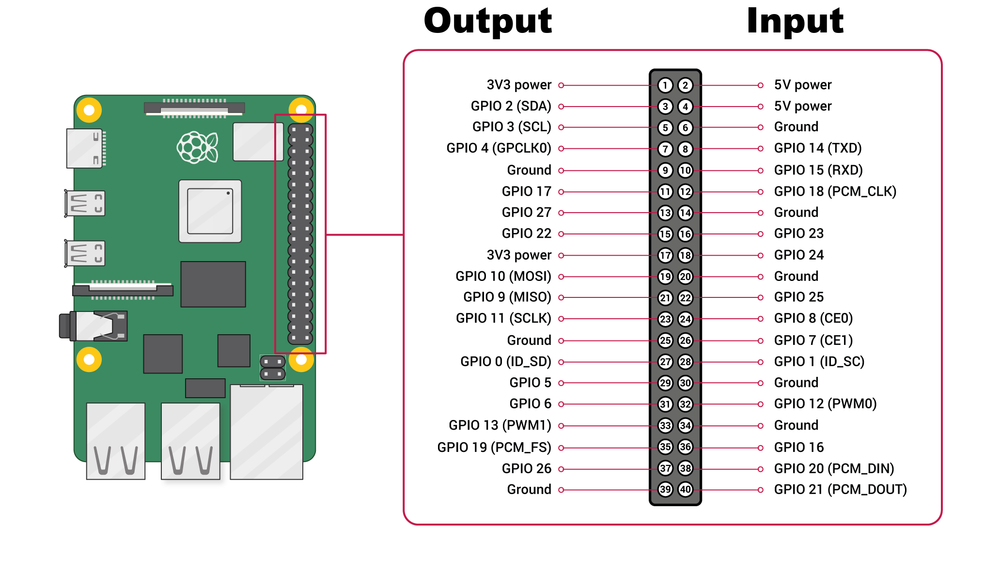
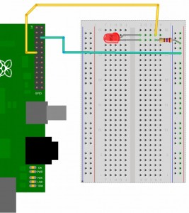
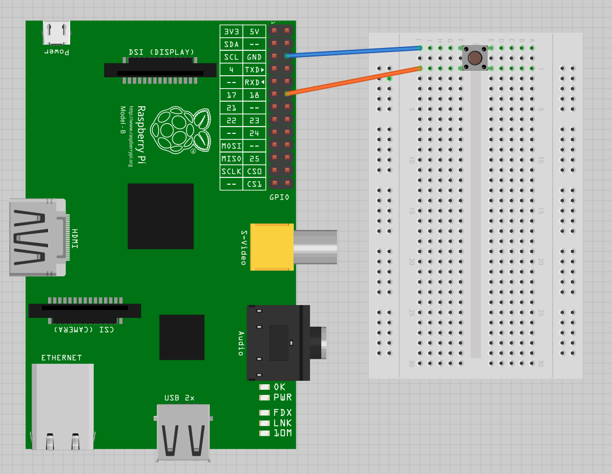

# Raspberry PI 
## Default Mapping in the Configuration
Currently, the `configuration.py` file contains the default mapping to GPIOs. You have the 
flexibility to change the input/output settings without impacting anything other than turning 
GPIOs into inputs or outputs. See the picture below:

The GPIO pins on the left side are configured as outputs, while those on the right side are configured as inputs. You can modify these settings in the `configuration.py` file under the capabilities section. The numbers listed represent GPIO pins, and FEAGI and RPI will use these pins accordingly.

## Current Availability of Input and Output for FEAGI
At present, FEAGI has the capability to read both input and output. To control the output, it 
relies on the cortical area's ID called "o_gpio." When you activate a specific voxel within this 
area,
it will correspond to the pin number.

The cortical area responsible for GPIO output is named "GPIO_out." If you select, for example, 2 
from the picture above, it will activate GPIO 2 as an output. There is also a cortical area's ID 
called "i_gpio," which displays red voxels based on the data it reads.

## Example with LED
You can utilize various examples available in Raspberry PI tutorials. For instance, I obtained the sample image from [here](https://projects.drogon.net/raspberry-pi/gpio-examples/tux-crossing/gpio-examples-1-a-single-led/). You can see it here:

The key distinction between tutorials and FEAGI is that you don't have to be concerned about the coding aspect. 
All you need to do is connect your electronics or follow the provided diagram, as shown above. 
It will function instantly. You can also plug and unplug in real-time. 
Returning to the LED example, you connect the positive end to pin 17 (GPIO17) and the ground to the negative end. 
Then, when you click on the "GPIO_out" cortical area, select the location corresponding to pin 17, and the LED will light up. 
You can adjust the refresh rate (Hz) depending on how long you want the LED to remain on.

## Example with switch button

Using the image from [here](http://razzpisampler.oreilly.com/ch07.html).

So, we will need a GPIO 18 and 18 in `GPIO_in` cortical area. Since this switch button will return 
`False` if you press the button, 
cutting off the electricity, that's how it is set up in the diagram. You can adjust it to meet your needs. 
FEAGI is extremely flexible for that. 
So, using the diagram above, you should see a red voxel displaying in the `GPIO_in` or the ID 
called `i_gpio` until you press the button, at which point the red voxel will disappear.